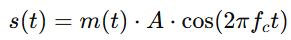
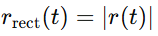

Step 1: Transmission

We are using On-Off Keying scheme for transmission. This means that the presence of carrier means a "1" and absence means "0".
This can be modelled the following way:

where:

- s(t) is the modulated signal
- m(t) is the square wave
- A is the amplitude of the carrier
- fc is the frequency of the carrier

Step 2: Reception

The reciever will recieve the signal including some noise. This is modelled:

- r(t) recieved signa
- s(t) original signal
- n(t) noise added during transmission
- term is attenuation, which we can neglect for now most likely
  - A0 = initilai amplitude of the transmitted signal
  - **e**−**α**(**f**)**d** attenuation factor over distance d with alpha(f) being the attenuation coefficient that depends on the frequency f of the transmitted signal.

Step 3: Envelope Detection Process

Recitify the signal 

Apply low pass filter
