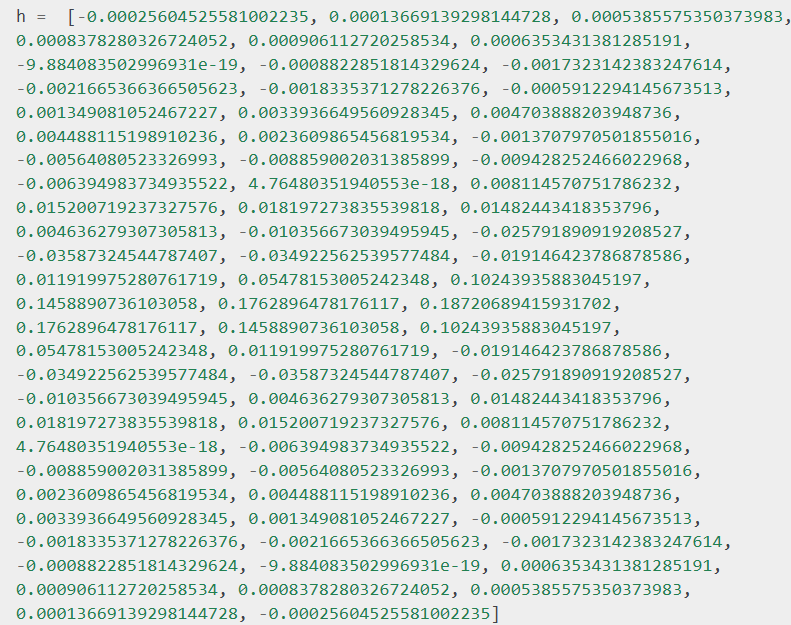
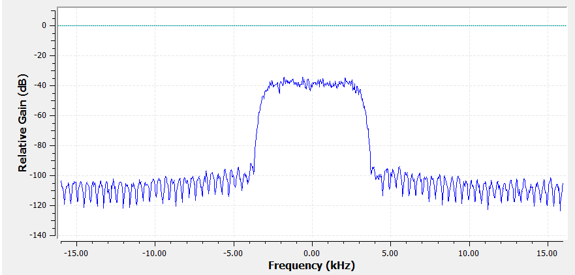

## Filters

There are two main classes of digital filters: Finite impulse response (FIR) and Infinite impules response. We only care about FIR :)

Filters are used for the following:

1. Separation of signals that have been combined (e.g., extracting the signal you want)
2. Removal of excess noise after receiving a signal
3. Restoration of signals that have been distorted in some way (e.g., an audio equalizer is a filter)

There exists 4 types:

- low pass - filters high frequencies at a given cutoff
- high pass - filters low frequencies and allow high ones
- band-pass - allow frequencies in some range
- band-stop - stops frequencies in some range

## Filter representation

Filters are represented as 1 dimensional array, and can be represented in the frequency and time domain. 

Below i show the 

- array representation
- frequency domain representaiton
- "impulse response" = time domain representation. It is called "Impulse response" because you get the time domain representation by convolving with a idealized impulse (dirac delta function).
- 

Not useful if we already have the correct filter. Imagine we have a unknown filter (probably hardware) then we can use a dirac delta function to get the time domain of the filter - and essentially the array representation.

Each float is called a filter tap, thus this filter contains 77 filter taps.
The more filter taps the sharper the transition width (how fast the Bode plot drops), but it becomes a heavier computation.

Frequency domain representation

## How does a filter work?

A filter takes a signal (1d array) and outputs a filtered signal (1d array).

A filter is essentially just a convolution given by the formula:

Lets see an example:

g(t) is the filter (shown as the moving green square)

f(t) is the signal (shown as black triangle)

the output is the red graph.
