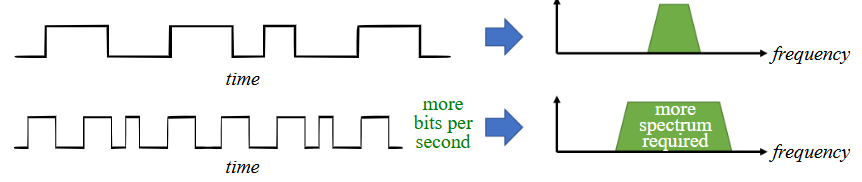

###### Fourier series

Breaking down a signal into its composite sine waves.How to actually do this in maths go to: https://mathworld.wolfram.com/FourierSeries.html

###### **Time-frequency pairs: Square wave**

Mathematically an ideal square wave consists of:

Thus a square wave is a sum of different sine waves with frequency k \* f0

The first is the fundamental frequency, the next one is fundamental * 3 etc... also the amplitude is divided by k thus the wave become smaller and small with greater and greater frequency.

This can be seen here:

###### Fourier Transform

Mathematically, to go between time and frequency domain we can use the Fourier Transform.

| From             | To               | Formula                                                 |
| ---------------- | ---------------- | ------------------------------------------------------- |
| Time domain      | Frequency Domain |  |
| Frequency domain | Time domain      |  |

- x(f)  = signal in the time domain.
- X(f) i= signal in frequency domain
- j = imaginary unit
- t = time
- f = freq

For coding find formulas that looks at finite points.

###### Time-Frequency properties

Properties that hold if we apply some change X to our signal in the time domain, some result Y will happen in the frequency domain.

**1. Linearity Property**

**2. Frequency Shift Property**

The complicated term on the left is a complex sinus wave. This property states that if we multiply a sinus wave to our signal with some frequency f0, then the frequencies of the signal in the frequency domain is shifted by f0.

**3.  Scaling in Time Property**

If we scale the time (t) by some **LARGE** factor (a) we stretch the signal in the time domain (the signal will simply take longer).
This results in a smaller range of frequencies as we divide by a a.

If we scale the time (t) by some **SMALL** factor (a) we compress the signal in the time domain (the signal will simply go faster). This results in a larger range of frequencies as we divide by a.

**BANDWIDTH**T: his has the important consequence that if we want to send more data (make our signal compact) we use more bandwidth. For our project we should therefore use the entire bandwidth/frequency spectrum that our speaker can output to send more data.

**4. Convolution in Time Property**

return to these when you know about filters

**5. Convolution in Frequency Property**

return to these when you know about filters

###### Fast Fourier Transform
