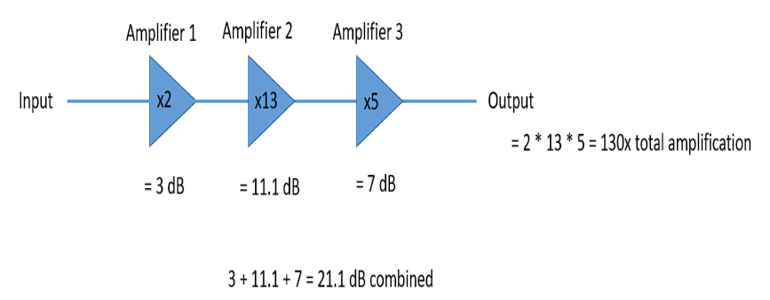
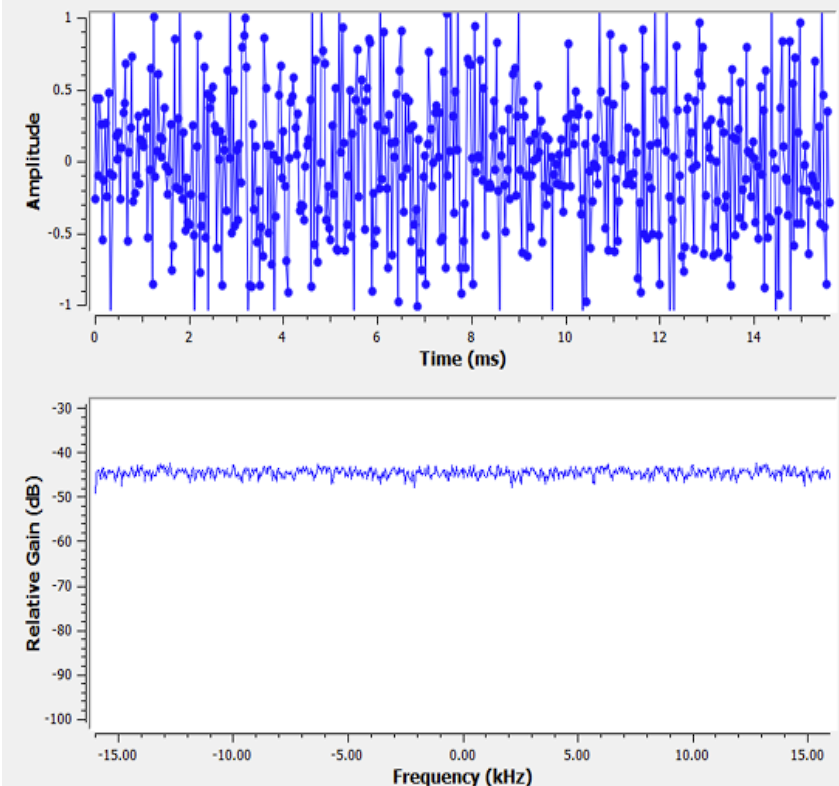

# Noise and Decibels

## Decibels

Decibels is a logarithmic way of describing a ratio, the ratio can be power, sound, pressure, voltage. When converting to decibels, do

$$
x_{dB} = 10 \log_{10} \cdot x
$$

when converting from decibels do

$$
x = 10^{\frac{x_{dB}}{10}}
$$

Remember to do $\log_{10}$ and not the natural log. Also that when in dB you add / subtract instead of divide / multiply.

Good ratios to remember between linear and dB

| Linear | dB     |
| ------ | ------ |
| 0.1x   | -10 dB |
| 0.5x   | -3 dB  |
| 1x     | 0 dB   |
| 2x     | 3 dB   |
| 10x    | 10 dB  |
| 100x   | 20 dB  |
| 1000x  | 30 dB  |
| 10000x | 40 dB  |

## Noise

**Gaussian noise**

The average of the noise is 0, if it wasnt we could simply subtract it and call it a bias and then have the noise. Most natural noise is Gaussian noise. The variance can be see as the power of the noise, as a larger variance will mean a larger unwanted fluctuations. Below is the time / freq pair of noise. It can be seen that it is fairly flat and the same across all frequencies. Gaussian noise is both Gaussian noise in the time and frequency domain.

## SNR

Signal-to-noise ratio is how we measure the strength between signal and noise, its a ratio so its unitsless, but its almost always given in dB. Below is the formula when the signal is in power and dB

$$
SNR = \frac{P_{signal}}{P_{noise}}
$$

$$
SNR_{dB} = P_{signal, dB} - P_{noise, dB}
$$

If the SNR = 0 dB then that means that signal and noise power are the same. A positive SNR means that our signal is higher power than the noise, while a negative SNR means that the noise is of higher power. Detecting signals at negative SNR is pretty tough. The power in a signal is equal to the variance of the signal, therefore

$$
SNR = \frac{P_{signal}}{P_{noise}} = \frac{\sigma^2_{signal}}{\sigma^2_{noise}}
$$

Addtionally, there is Signal-to-Interference-plus-Noise Ratio (SINR), its the same as SNR, however there is some interference that you cannot simply filter out for some reason

$$
SINR = \frac{P_{signal}}{P_{interference} + P_{noise}}
$$
