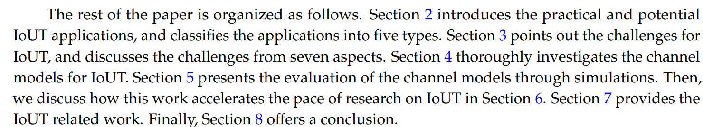
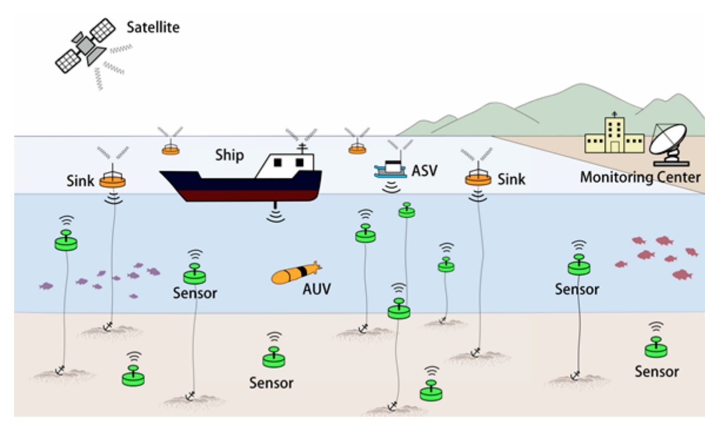
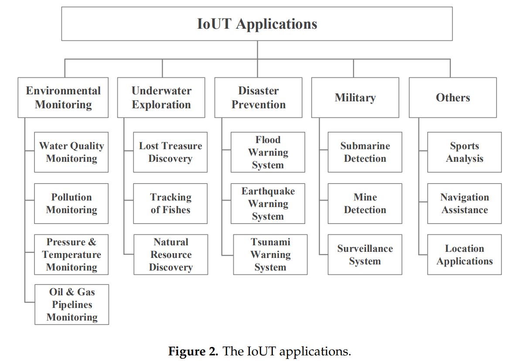
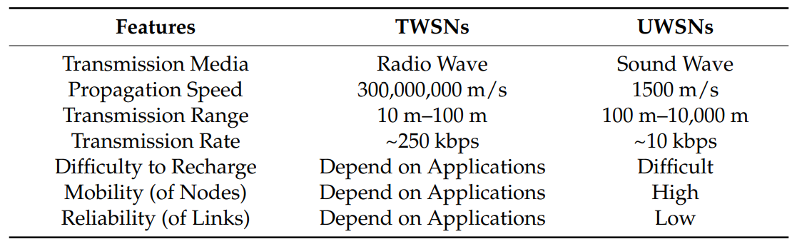

###### Content of paper

###### 1 IoUT definition:

IoUT is defined as
“the network of smart interconnected underwater objects.” As shown in Figure 1, the smart objects
could be different types of underwater sensors, autonomous underwater vehicles (AUVs), autonomous
surface vehicles (ASVs), buoys, ships, etc. IoUT is a new class of IoT and an important part of smart
city evolution.

###### 2 Novelty: why start doing IoUT?

First, more than 70% of the earth’s surface is covered by water, and the majority of the underwater areas are still unexplored.
Second, IoUT is expected to enable numerous applications in smart cities.
Third, the underwater
communication and equipment waterproofing

###### 3 Challenges:  Standard IoT versus IoUT

###### 4 og 5 Channel models & reliability

How to look at relibaility on how much we loose 

"**Channel models** in **IoUT** describe how signals **propagate** through the underwater environment, helping predict signal strength, reliability, and performance" from chat
