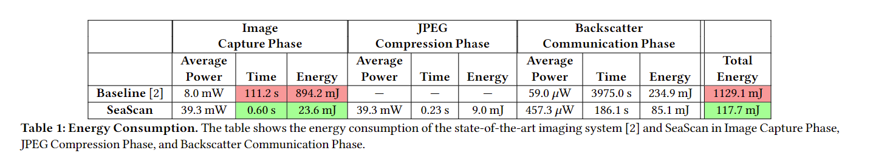
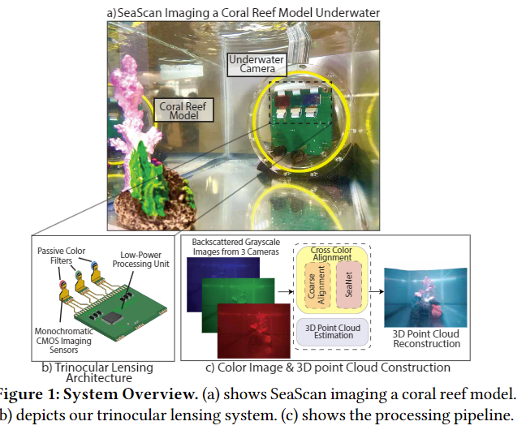

# SeaScan - underwater 3D color imaging, ultra low-power consumption

By using three different mono-chromatic (an image containing only one color / hue, red, green, blue) lenses to capture an image and then combining them using some image analysis methods and some machine learning they are are to outperform the baseline. The picture quaility is comparable to that of a GoPro 9. The main focus of the article is how that you simply cant take the three images taken from the three different lenses at apply some transformation to make the pictures align, you need to do some cleaver tricks, which is their machine learning SeaNet.

**Key points**

- We need to apply some kind of image compression (JPEG) to lower how much data we need to transfer
- Also we need to do some calculations on exactly how much power etc we need -> if it takes 13 minutes to send a picuture, were doomed
- They are able to store 320 x 240 pixel images temporarly in their SRAM (static RAM, retains the data as long as the power is on), this is becuase their micro controller has 274 KBytes of SRAM -> figure out how much our has
- Ask if we can get an underwater camera :)

**Motivation**

- New species, monitoring wildlife + human impact on the sea life
- Fish farms -> detecting dieses
- Oceanopraghy -> dynamics of the ocean carbon cycle and habit deteoriation of the coral reef

**Set-up**

Image of the issues by just combining the images from the three different lenses

The total setup

