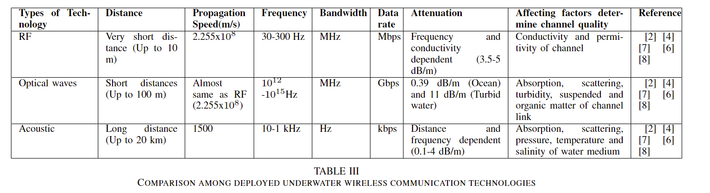
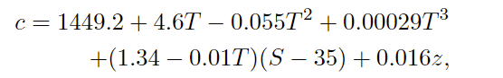

The article compares different kinds of UWC (underwater wireless communication) and explains their different attributes, shown in the table below. The main aim of the article is to show the current status of UWC and what the current challenges for each of the different communication methods are.

Base propagation speed for acoustic waves underwater: 1500 m/s, this increases with 4 m/s per second by 1 degree of celcius

Sound speed profile (SSP) (the speed at which waves travel at different depths, different temperatures and salinity.

[SSP wikipedia](https://en.wikipedia.org/wiki/Sound_speed_profile)

where c is the acoustic wave speed and T is the channel temp, S represents the salinity, z is the depth

Most common issues in relation to underwater acoustic communication

- Signal propagation energy loses, absorption and scattering loss
- Man-made and ambient noise
- Attenuation, where the acoustic energy is transformed into heat energy and absorbtion losses
- Path and multipath loses from degradation of the waves which generates ISI (inter-symbol interference) (one symbol interferes with subsequent symbols)
- Doppler shift
