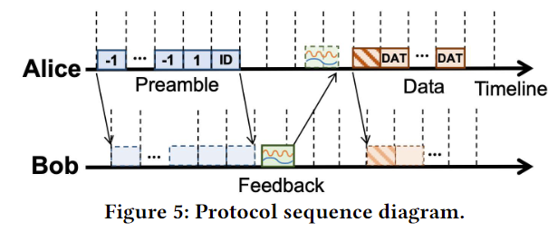
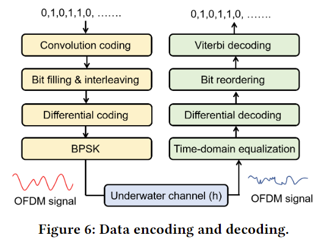

- Made an app that allows two smartphones (android devices) to be able to communicate underwater using their built in microphone and speaker to communicate using acoustic waves. They achieve this by using orthognal frequency-division multiplexing (OFDM), a technique used in digital modulation to encode bits onto several carrier frequencies at the same time. Multiple bits is divided on to multiple different -> multiple bits being transmitted in parallel.
- When encoding their data they have an algorithm that depending on the distance between the two communicators allocate the power to the frequency that is most suitable
- Bitrate: 1.8 kbps, range: 30 meters
- Bitrate 10-20 bps, range 10bp0 meters
- To take into account the ambient noise, they measured for 5 seconds in the same location using different devices
- Doppler shift: the difference in frequency from the transmitter to the reciever depending on the velocity of the transmitter and receiver (could maybe skew the frequency we are expecting to recieve, however since our transmistter / receiver both will have velocity close to 0 m/s and the acoustic waves travel around 1500 m/s underwater, it prolly wont be a problem)
- Tested in several different locations, with different amount of noise -> (lake, harbour) -> resulted in different bit rates being more effective at different locations ?
- Maybe look into convolutional coding, to encode our data in more secure way.
- Below is their data transfer protocol

  - Preamble is used before any data is transmitted to make a connection and send receiver ID. It is also used for their frequency band selection algorithm, where they somehow use a range from 1 - 4 kHz to find the optimal band

  
- Below is their encoding pipeline

  - Convolutional coding: used to encode extra bits into the bit stream, to make it error-correcting, used when date is sent in one long stream instead of sent as blocks
  - Differential coding: often used when modulating when PSK (phase shift keying) as the differential coding prevents inversion of signal and phase
  - Time-domain equalization: using MMSE (minimum mean square eqalization) is used to estimate how close the received signal is to the transmitted signal
  - Viterbi decoding: a method to decode a bit stream that was encoded using concolutional coding

  
