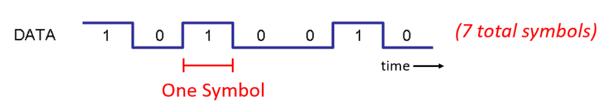
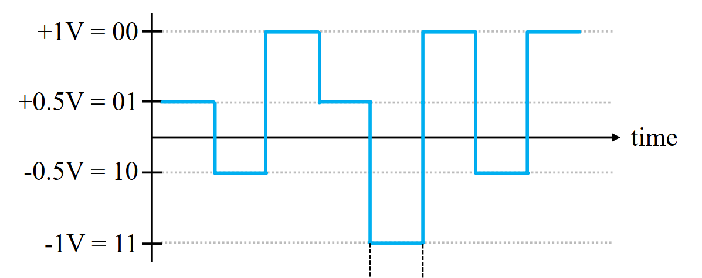
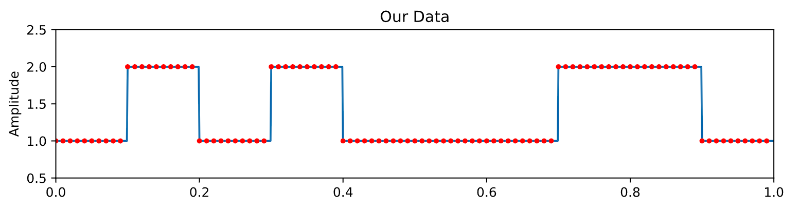

# Communication theory

## Symbols and bits

Bits per second = bps

Bit rate = the number of bits communicated per unit of time (expressed in bps)

Symbol = has some number of bits of information (1bit per symbol, 2bits per symbol) (we mostly just do 1 bit per symbol)

Samples per symbol = the amount of samples we use to make up one symbol (10 samples = 1 symbol = 1 bit of information -> either 1 or 0)

**1 Bit Per Symbol**

**2 Bits Per Symbol**

**10 Samples Per Symbol (1 bit per symbol)**

## Bandwidth

**Bandwidth (computing)**

The maximum rate of data transfer across a given path (the data transfer is given in bps)

**Bandwidth (signal processing)**

The difference between the upper and lower frequencies in a continuous band of frequencies (our signal is a continous band of frequencies)

Passband bandwidth is the difference between the upper and lower cutoff frequencies (maybe we only want 5000 - 10000 Hz, so we cut off everything below 5 kHz and everything above 10 Kz, thats our passband bandwidth)

Baseband bandwidth is equal to the upper limit of the cutoff frequency of a low-pass filter or a baseband signal that includes a 0 Hz frequency (we will mostly use baseband with a low-pass filter)

