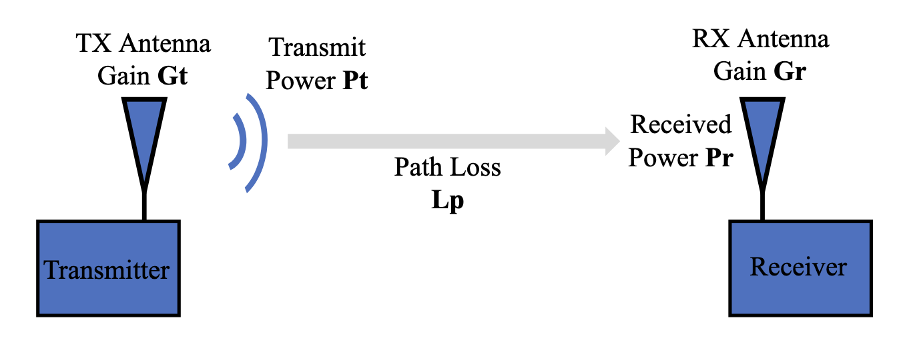
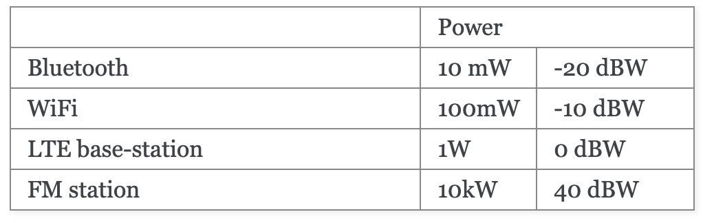
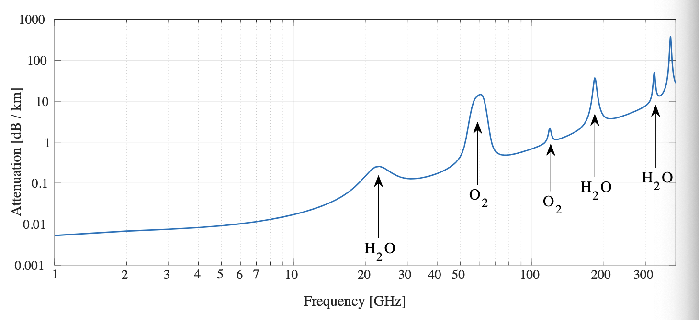

# Link Budgets
The purpose of link budgets is to systematically try to determine the power of the signal at the receiver. 
This is done by by accounting for all the losses and gains from the transmitter to the receiver. For the purpose of our project we should construct a link budget that describes the power loss from the transmitter to the receiver and only in this direction as we don't return a signal from the hbydrophone to the speaker. 

The “result” of the link budget will tell you roughly how much signal-to-noise ratio (abbreviated as SNR, which this textbook uses, or S/N) you should expect to have at your receiver. Further analysis would be needed to check if that SNR is high enough for your application.
'Copy from pysdr'

See reference [click here](https://pysdr.org/content/link_budgets.html?highlight=downlink)

___

## Signal Power Budget
To determine the received power, we need to account for 4 variables: 

- $Pt$ - Transmit power
- $Gt$ - Gain of transmit antenna
- $Gr$ - Gain of receive antenna
- $Lp$ - Distance between $Tx$ (transmitter) and $Rx$ (receiver) (i.e., how much wireless path loss)

#### Transmit Power
Transmit power for acoustic signals - $Pt$ - is the power of the signal at the transmitter. This is the power that the transmitter puts into the signal. Unit is in watts or dBW.

Examples: 

___

#### Antenna Gains
The antenna gain indicates the directivity of the antenna. i.e. our speaker generates signal in a direction out in the pool and does not generate signal with equal strenght 360 degrees around it.

For omnidirectional antennas, the gain will be 0 dB to 3 dB. For directional antennas, the gain can be 5dB or higher (up to 60dB).

In general, if you are dealing with directional speakers/antennas assume ideal conditions i.e. the antenna is pointing in the most efficient direction.

#### Path Loss

As a signal moves through the air (or water or vacuum), it reduces in strength. Imagine holding a small solar panel in front of a light bulb. The further away the solar panel is, the less energy it will absorb from the light bulb. **Flux** (Recall math 1) defines as “how much stuff goes through your thing”. For us, it’s the amount of electromagnetic field / pressure (for acoustic) passing into our receive antenna. We want to know how much power is lost, for a given distance.

In ideal conditions, the path loss is also called Free Space Path Loss and it is calculated as:
$$
FSPL = \left(\frac{4\pi d}{\lambda}\right)^2
$$

Where:
- $d$ is the distance between the transmitter and receiver
- $\lambda$ is the wavelength of the signal

We can convert this to dB by taking the log of the equation:
$$
-L_{p} = FSPL_{dB} = 20\log_{10} d + 20\log_{10} f + 20\log - 147.55[dB]
$$

Where:
- $d$ is the distance between the transmitter and receiver in meters
- $f$ is the carrier frequency of the signal in Hz

To better understand the path loss for acoustic waves in water please see [here](https://abl.gtu.edu.tr/Dosya/102/~saksoy/Useful%20Knowledge/PRESENTATIONS/Fundamentals%20of%20Underwater%20Acoustics%20-%20Dr.%20Serkan%20AKSOY%20-%20Sunum.pdf). 
**WARNING** Very technical powerpoint slides and would not recommend unless we are required to do so to construct a link budget for our system.

#### Signal Power Equation
$$
Pr = Pt + Gt + Gr - Lp - Lmisc
$$

Where:
- $Pr$ is the received power
- $Pt$ is the transmit power
- $Gt$ is the gain of the transmit antenna
- $Gr$ is the gain of the receive antenna
- $Lp$ is the path loss
- $Lmisc$ is the miscellaneous losses.

However, due to frequencies being used in our project are quite low ($< 100MHz$) we can ignore the miscellaneous losses. see pySDR

Thus, the equation simplifies to:
$$
Pr = Pt + Gt + Gr - Lp
$$

## Noise Power Budget

`Important fact about noise in signals`: 
Now is a good time to talk about where noise enters our communications link. Answer: At the receiver! The signal is not corrupted with noise until we go to receive it. It is extremely important to understand this fact! Many students don’t quite internalize it, and they end up making a foolish error as a result. There is not noise floating around us in the air. The noise comes from the fact that our receiver has an amplifier and other electronics that are not perfect and not at 0 degrees Kelvin (K).

An approach tp formulate the noise budget is by the "kTB" approach. This is a simple way to estimate the noise power in a receiver. The noise power is given by the equation:
$$
Pn = kTB
$$

Where:
- $Pn$ is the noise power
- $k$ is the Boltzmann constant ($1.38 \times 10^{-23} J/K$) = $-228.6 dBW/K/Hz$. This is a constant that from chemistry and physics that relates temperature to energy.
T – System noise temperature in Kelvin (K), largely based on our amplifier. This is the term that is most difficult to find, and is usually very approximate. Maybe look at the datasheet of the amplifier and the hydrophone to find this value.
$B$ - Signal Bandwidth in Hz, assuming no noise hwo wide is the signal we are looking at i.e. 10kHz, 20kHz, 50kHz etc. 

## Signal-to-Noise Ratio (SNR)
With both the signal power and noise power, we can calculate the signal-to-noise ratio (SNR) as:
$$
SNR = \frac{P_{signal}}{P_{noise}}

\implies SNR_{dB} = P_{signal_{dB}} - P_{noise_{dB}}
$$

Where:
- $P_{signal}$ is the signal power
- $P_{noise}$ is the noise power

As a rule of thumb shoot for a SNR of 10 dB or higher. (pySDR statement).  
In practice, SNR can be verified by looking at the FFT of the received signal or by calculating the power with and without the signal present (recall variance = power). The higher the SNR, the more bits per symbol you can manage without too many errors.

