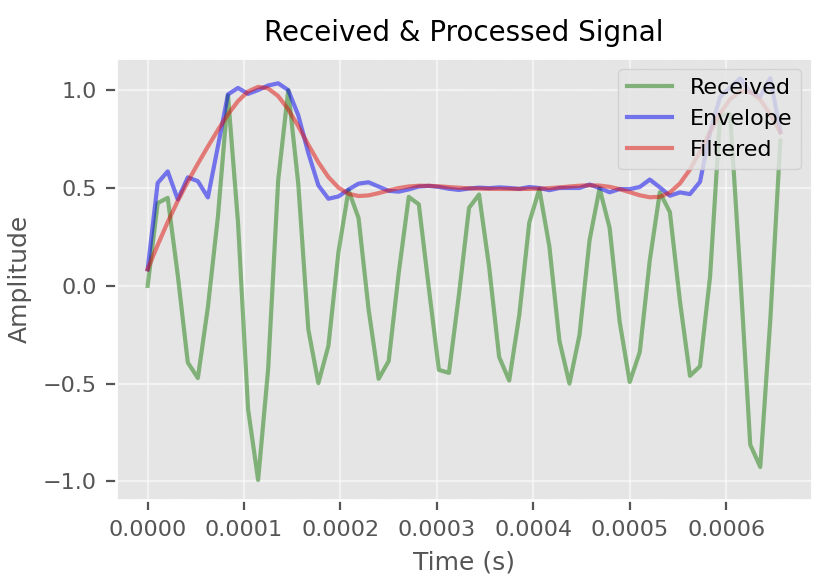

- [Digital Signal Processing (DSP)](#digital-signal-processing-dsp)
  - [0. Introduction](#0-introduction)
  - [1. DSP on the transmitting end](#1-dsp-on-the-transmitting-end)
  - [2. DSP on the receiving end](#2-dsp-on-the-receiving-end)

# Digital Signal Processing (DSP)
## 0. Introduction
In this project dsp has been used significantly to process underwater acoustic communication signals. For stage 1, the main focus was to grasp the basic concepts of dsp and to understand how to send robust signals in a noisy environment such as water. For simplicity during an amplitude modulation scheme has been used to send the signal. 

## 1. DSP on the transmitting end
The first step in the dsp process is to generate a signal that can be sent through the water. The signal is generated by modulating a carrier signal with the message signal. The carrier signal is a high-frequency signal that is modulated by the message signal. The message signal is the signal that contains the information that needs to be sent. To facilitate an easier demodulation process, the carrier signal is chosen to be of a frequency at least a few order of magnitudes higher than the message signal. i.e. the carrier signal $f_{c} = 15.2 kHz$ and the bit rate $f_{b} = 1 kHz$. 

## 2. DSP on the receiving end

